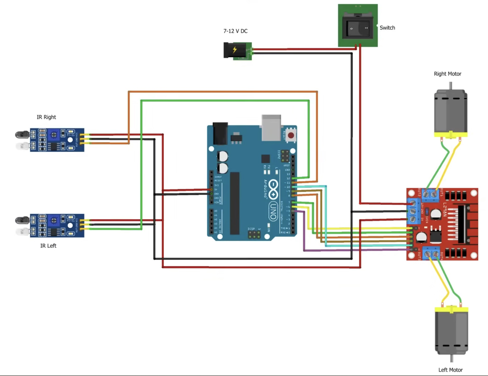
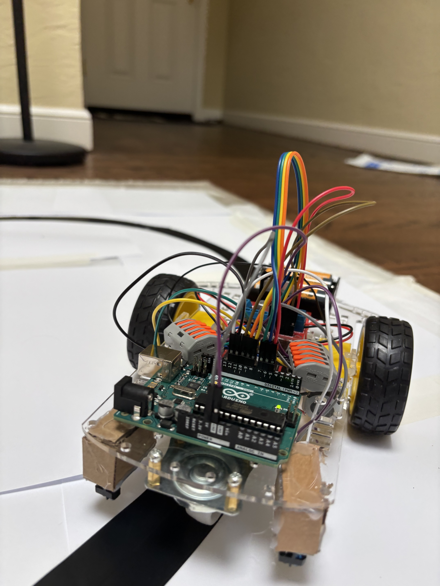
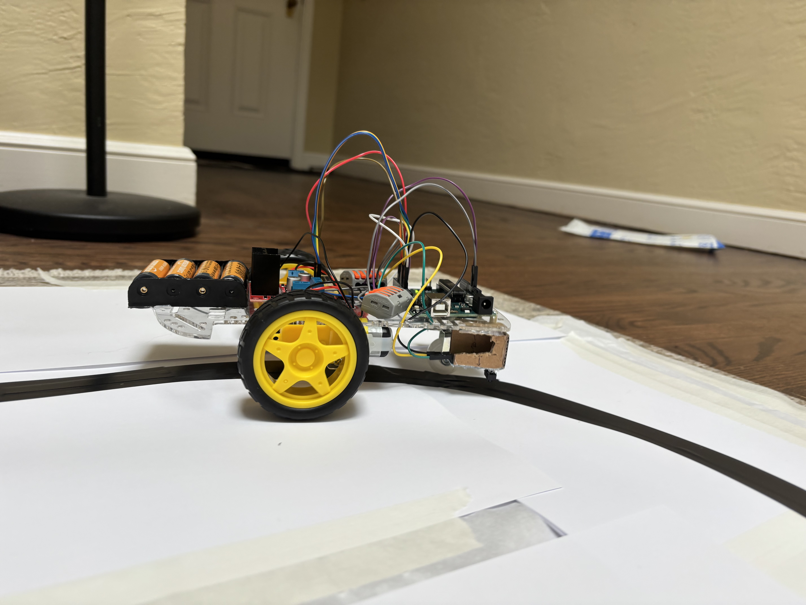
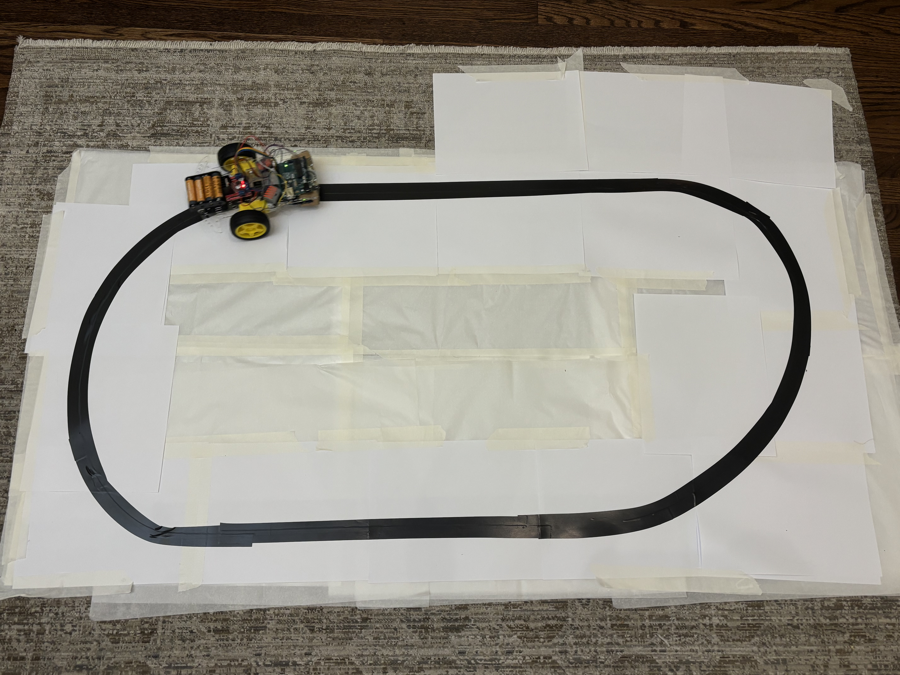

# Line Following Robot

A two-wheeled differential drive robot that autonomously follows a black line 
on a white surface using infrared sensors and an Arduino Uno.

## Demo
click for video

## Hardware Components
| Component | Quantity |
|---|---|
| Arduino Uno R3 | 1 |
| L298N motor driver module | 1 |
| IR sensor modules (TCRT5000) | 2 |
| 2WD robot car chassis kit (TT motors) | 1 |
| 4x AA battery holder | 1 |
| Rocker switch | 1 |
| Jumper wires | assorted |
| Lever nut connectors | 2 |

## Wiring

### Pin Mapping
| L298N | Arduino |
|---|---|
| ENA | D6 |
| IN1 | D7 |
| IN2 | D8 |
| IN3 | D9 |
| IN4 | D10 |
| ENB | D5 |

| IR Sensor | Arduino |
|---|---|
| Left DO | D11 |
| Right DO | D12 |

## How It Works
Two IR sensors are mounted at the front of the chassis straddling a black 
electrical tape line. Each sensor emits infrared light downward — white 
surfaces reflect IR back (sensor reads LOW) while black surfaces absorb it 
(sensor reads HIGH).

The Arduino reads both sensors 100 times per second and drives the L298N 
motor driver accordingly:
- Both sensors on white → drive forward
- Right sensor on black → reverse right motor to correct left
- Left sensor on black → reverse left motor to correct right
- Both sensors on black → stop

Motor speed is tuned via PWM to balance the two TT motors and overcome 
static friction at startup.

## Code
The sketch is in `code/line_follower.ino`. Key tuning variables at the top:
- `rightSpeed` / `leftSpeed` — balance motors if robot drifts
- `turnSpeed` — controls correction aggressiveness

## Build Photos

## Known Limitations
- Binary sensor logic (on/off) causes slight oscillation around the line 
  rather than smooth tracking
- Sensor spacing (~65mm) requires gradual curves; sharp corners cause 
  tracking failures
- Performance degrades as AA batteries drain due to voltage sag

## Future Improvements
- PID control loop for smoother line tracking
- Additional center sensor for more precise positioning
- Upgrade to LiPo battery for consistent voltage
- Encoder feedback for closed-loop speed control
- Port to ROS2 as part of broader robotics learning path

## What I Learned
- DC motor control via PWM and H-bridge circuits
- IR sensor calibration and digital signal reading
- Closed-loop control fundamentals (sense → decide → act)
- Soldering, wire management, and hardware debugging
- Arduino IDE, C++ sketch structure, and serial debugging

## Acknowledgements
Wiring and base code structure adapted from 
[this YouTube tutorial](https://www.youtube.com/watch?v=5jh-5HGvC-I), modified for different 
pin assignments and tuned for this specific hardware configuration.